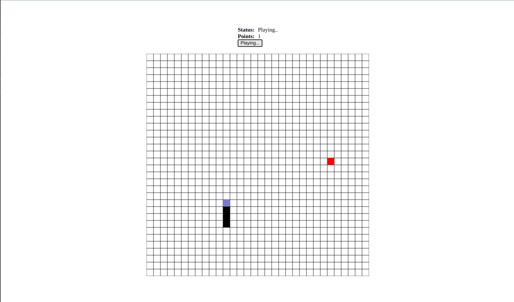

# snake_game_rust_webassembly
A rust web snake game app with web assembly.

## Language
### Rust
```
v1.78.0
```
### Node.js
```
v16.13.1
```

## Installation
### Clone
```
git clone git@github.com:Njaya2019/snake_game_rust_webassembly.git
```

### Install project dependencies
```
cargo build
```

## Run
### Compile rust to wasm
```
wasm-pack build --target web
```

### Run web server
### cd into www folder
```
cd www
```
### install dependencies
```
npm install
```

### Run server
```
npm run dev
```

## Page
```
GET http://localhost:8080/
```